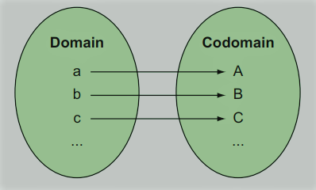
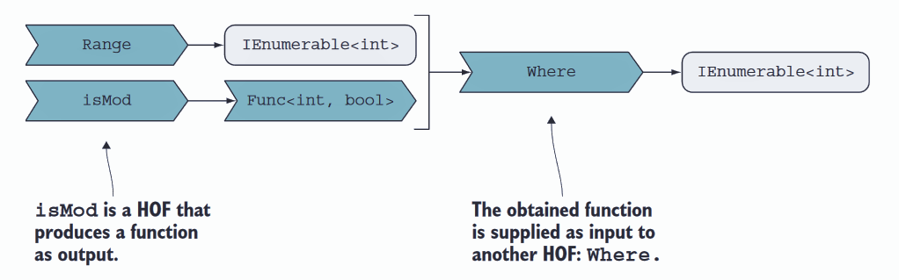

# Reading notes

## Introduction

Functional programming (**FP**) gives you:

- **Power** - Get more done with less code. Every line is a liability and asset. By reducing code size you are having less liability by keeping the assets.
- **Safety** - Stronger typing and declarative style of writing code. This is especially beneficial when dealing with concurrency due to function purity and state immutability.
- **Clarity** - Code is more readable and understandable. This is especially important during consumption and maintenance of the existing code.

FP emphasizes functions while avoiding state mutation (functions don't have side effects). In FP, functions are first-class values. C# has functions as first-class values, e.g.

```c#
Func<int, int> triple = x => x * 3; // function as a variable
var range = Enumerable.Range(1, 3);
var triples = range.Select(triple); // x => x * 3 instead of triple

Output:
3,6,9
```

FP rules are when the object is created it should never change again and the variable should never be reassigned.

Mutation (**in-place** value change) example:

```c#
int[] nums = { 1, 2, 3 };
nums[0] = 7; // update

// Also called destructive update as the value stored prior to the update is destroyed.
```

Mutation (in-place update) -> sorting example:

```c#
var original = new List<int> { 5, 7, 1 };
original.Sort();

// original is now 1, 5, 7 where the original order is destroyed and lost forever. (This Sort() method is introduced before LINQ and the change in to functional direction)
```

Pure FP languages don't allow in-place updates.

Following this principle, sorting or filtering should never update existing list but create a new one without affecting the old one, e.g.

```c#
Func<int, bool> isOdd = x => x % 2 == 1;
int[] original = { 7, 6, 1 };
var sorted = original.OrderBy(x => x);
var filtered = original.Where(isOdd);  // x => x % 2 == 1 instead of isOdd
```

Parallel execution example:

```c#
var nums = Range(-10000, 10000).Reverse().ToList();
Action task1 = () => WriteLine(nums.Sum());
Action task2 = () => { nums.Sort(); WriteLine(nums.Sum()); };
Parallel.Invoke(task1, task2);

// some wrong result
// 0 -> correct
```

`Sort()` as mentioned is not a pure function and it mutates the state of the nums which is used by `task1` hence the wrong computation.

Using `LINQ`'s `OrderBy(x => x)` will give correct result as it is a pure function that returns a new collection.

**C#'s garbage collection makes a programming model that avoids in-place updates possible.**

However, by default everything in C# is mutable and the only way to disable mutation is by marking something as `readonly`. This is opposite to what F# has. You have to mark something mutable to enable its mutation.

Usually, C# developers work with sequences (`IEnumerable`) in a right (functional) way and with everything else in an imperative way. This is due to the lack of understanding of the design principles behind `LINQ`.

C# has get-only auto properties -> complier implicitly declares readonly backing field.

```c#
public string Name { get; } // value can only be assigned in constructor.

public class Person
{
    public Person(string name) => Name = name;
}
```

After construction of `Person` object, the object can never change, therefore we can say it is immutable.

In mathematics, a function is a `map` between 2 sets (`domain` and `codomain`). Given an element from its domain, a function yields an element
from its codomain.

</img>


The types for the domain and codomain constitute a function’s `interface`, also
called its type, or signature. You can think of this as a contract: a function signature declares that, given an element from the domain, it will yield an element from the codomain.

In C# we have different to represetn functions:

#### **Methods**

Fit in the OOP world -> can be overloaded, can implement interface, etc.

#### **Delegates** and **Lambda Expressions**

Type-safe function pointers. Delegate and it's implementation are similar to the interface and the implementing class. It is done in a 2-step process. You first define delegate with it's signature and then you instantiate it with implementation.

```c#
public delegate int Comparison<in T>(T x, T y);

Comparison<int> alphabetically = (l, r) => l.ToString().CompareTo(r.ToString();

list.Sort(alphabetically);
```

We can see that it is similar to interface-class relationship. Interface defines the contract and class's responsibility is how to implement it. So we have a delegate that represents an interface (but it is an object) for the function object that implements it. Thanks to delegates, C# has functions as first-class values.

In newer versions of the language, `Func` and `Action` types with various `arities` (number of arguments that a function accepts) are used instead of a raw delegate as it is more straight-forward and produces less code. 

```c#
Func<int, bool> greaterThanZero = x => x > 0; // e.g. predicate
```

`=>` represents a lambda expression or just `lamba` used to declare a function inline.

A `closure` is the combination of the lambda expression itself along with the context in which that lambda is declared.

In C#'s terminology, a `predicate` is a function that, given any input (say, an integer), tells you whether it satisfies some condition by returning bool (say, whether it’s greater than zero).

However, sometimes it is more visible of what the function is doing by looking at the delegate rather than directly jumping into the implementation. Again, this is the same situation as in interface-class relationship.

```c#
public delegate bool GreaterThanZero(int x);
GreaterThanZero greaterThanZero = x => x > 0;
```

#### **Dictionaries**

Even though they are data structures and we think of them as data, they can be considers as functions as well. More specifically, `map` functions. They contain the association of keys (elements from the domain) to values (the corresponding elements from the codomain).

```c#
var frenchFor = new Dictionary<bool, string>
{
    [true] = "Vrai",
    [false] = "Faux",
};

frenchFor[true]; // function application performed by a lookup.
```

Dictionaries are useful when the mappings can't be computed but stored.


### **Higher-order functions (HOFs)**

Functions that accept other functions as arguments, return functions or both are called HOFs.

They are usually used in functions that either iteratively or conditionally apply function given as an argument, e.g.

```c#
listOfStrings.Where(x => x.Contains("s")) // higher order function that accepts an IEnumerable and a predicate as an argument.
```

The most common pattern for HOFs is used in case of a `callback` (inversion of control).

```c#
public Get(Guid id, Func<T> callback);
```

Some functions (`adapter` functions) don't apply the specified function but rather return the new function. That new function will call the underlying function that was passed as an argument in a modified way.

```c#
Func<int, int, int> divide = (x, y) => x / y;
var divideBy = divide.SwapArgs(); // will create a new function that calls divide function in a modified way.

divide(10, 2); // 5
divideBy(2, 10) // 5 swapped arguments. It will call underlying divide(10, 2).

                                                      expression-bodied syntax
                                                                  ||
                                                                  \/
static Func<T2, T1, R> SwapArgs<T1, T2, R>(this Func<T1, T2, R> f) => (t2, t1) => f(t1, t2);
                                                                              /\
                                                                              ||
                                                                        lambda expression
```
They are called adapter functions as the concept comes from OOP where adapter is overriding behavior (sometimes even interface by introducing a wrapper function) of the existing function.

In C# you cannot define delegates using implicitly typed local variables (`var`). Inference helpers in C# can be defined as HOFs that accept a function as an input and return the same function as the output.

```c#
public static Func<T1, T2> func<T1, T2>(Func<T1, T2> func) => func;
public static Action<T1> act<T1>(Action<T1> action) => action;

var f = func((int x) => x * 3); // Func<int, int>
var a = act((int x) => {/* some operation */}); // Action<int>
```

Sometimes primary job of HOFs is to produce other functions (function `factories`).

```c#
Func<int, bool> isMod(int n) => i => i % n == 0; // function that creates a predicate for checking if a certain number is divisible with n.
Range(1, 20).Where(isMod(2))
```

</img>

Sometimes we need HOFs to accept functions as a arguments and return functions.

```c#
Func<Func<int, int>, Func<int, int>> twice = f => x => f(f(x)); // result of f(x) is int and is used as an argument to call f one more time.
Func<int, int> plusFour = x => x + 4;

Console.WriteLine(twice(plusFour)(7)); // twice(plusFour) is a function invoked with argument 7 that will produce 15.
```

HOFs are also used as wrappers to deal with repeatable code and hide implementation detail where appropriate. By that we achieve conciseness, avoiding duplication, separation of concerns.

```c#
public static T Connect<T>(string connString, Func<IDbConnection, T> f)
{
    using var conn = new SqlConnection(connString);
    conn.Open();
    return f(conn); // what happens here is parameterized.
}

public IEnumerable<LogMessage> GetLogs() => Connect(connString, c => c.Query<LogMessage>(/* some query */)); // this method calls Connect passing a function as an argument that performs the query. It does not care about how and when the connection is opened, closed, disposed, etc.
```

Using as well can be made as a HOF. It would then be an expression rather than a statement which is useful in composition with other functions (`expressions` return a value; `statements` don’t).

Drawbacks of HOFs are increased stack use (callbacks, repackaged callbacks, etc.) which can impact performance (negligible though) and a bit more complex debugging because of callbacks.

## Purity

| `Pure functions`                                          | `Impure functions`                                            |
| --------------------------------------------------------- | ------------------------------------------------------------- |
| **The output depends entirely on the input arguments.**   | **Factors other than input arguments may affect the output.** |
| **Cause no side effects.**                                | **May cause side effects.**                                   |
|                                                           |                                                               |

Functions that do one of the following are not pure functions:

 - `Mutate` global state.
 - `Mutate` input arguments.
 - Throw `exception`.
 - Perform `I/O` operation.

Therefore, pure functions are easy to test and reason about because they always do the same thing. This leads to possibility of safe optimization (`parallelization`, `lazy evaluation`, `memorization`).

But in the `real-world` application you can hardly/cannot do anything with only pure functions. Any application that `"does"` something includes operations that are impure (e.g. communication with external resources -> file systems, databases, external APIs, etc.).

What you can do is:

 - Isolate `I/O` effects (`impure-pure-impure`).
 - Avoid mutating arguments and make functions `isolated` (not depending on each others implementation, work with `immutable` objects).
 - Handle errors functionally (Try, Either, etc.)
 - Make non-local state immutable.

