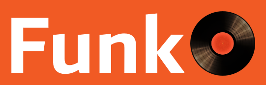

<h1 style="color:#f15a24; font-family:Roboto"> </h1>

## Functional library for C# programming language.

Author: [Harun Ćerim](https://cz.linkedin.com/in/haruncerim)

Supervisor: [Pavel Parízek](https://d3s.mff.cuni.cz/people/pavelparizek/)

**Diploma thesis topic:**

Bugs in software are very common due to mistakes developers make in the source code. For example, in the case of the programs written in the C# programming language, some of the most common exceptions that occur during runtime of the application are [System.NullReferenceException](https://docs.microsoft.com/en-us/dotnet/api/system.nullreferenceexception?view=netframework-4.8) and [System.InvalidCastException](https://docs.microsoft.com/en-us/dotnet/api/system.invalidcastexception?view=netframework-4.8). 

The main goal of this thesis project is to implement a library that will extend the C# programming language with support for concepts present in functional programming languages, such as F# and Scala, in order to address the kinds of issues and bugs mentioned above. 

The library will utilize many functional programming concepts, including immutability, pattern matching and monads, together with stronger typing. Introduction of these concepts into the C# language will help in avoiding many bugs and boilerplate code, and it will also let developers write C# code in a declarative rather than in an imperative way, making the day-to-day software development easier and less error-prone.

The following specific tasks should also be performed within the scope of this thesis project:
- analyze and compare this library with existing functional libraries such as language-ext and FuncSharp.
- analyze new features of the C# 8.0 language that include nullable reference types and pattern matching.

**References:**

- [Louth P., language-ext (2014-present)](https://github.com/louthy/language-ext).

- [Široký J., FuncSharp (2015-present)](https://github.com/siroky/FuncSharp).

- [Skeet, J., 2019. C# In Depth, Fourth Edition](https://www.manning.com/books/c-sharp-in-depth-fourth-edition).

- [Buonanno, E., 2018. Functional Programming In C#](https://www.manning.com/books/functional-programming-in-c-sharp).

- [Abraham, I., 2018. Get Programming With F#](https://www.manning.com/books/get-programming-with-f-sharp).

# Notes

Notes for the project can be found [here](/Files/notes.md).

# License

Funk is licensed under the [MIT](/Files/license.txt) license.